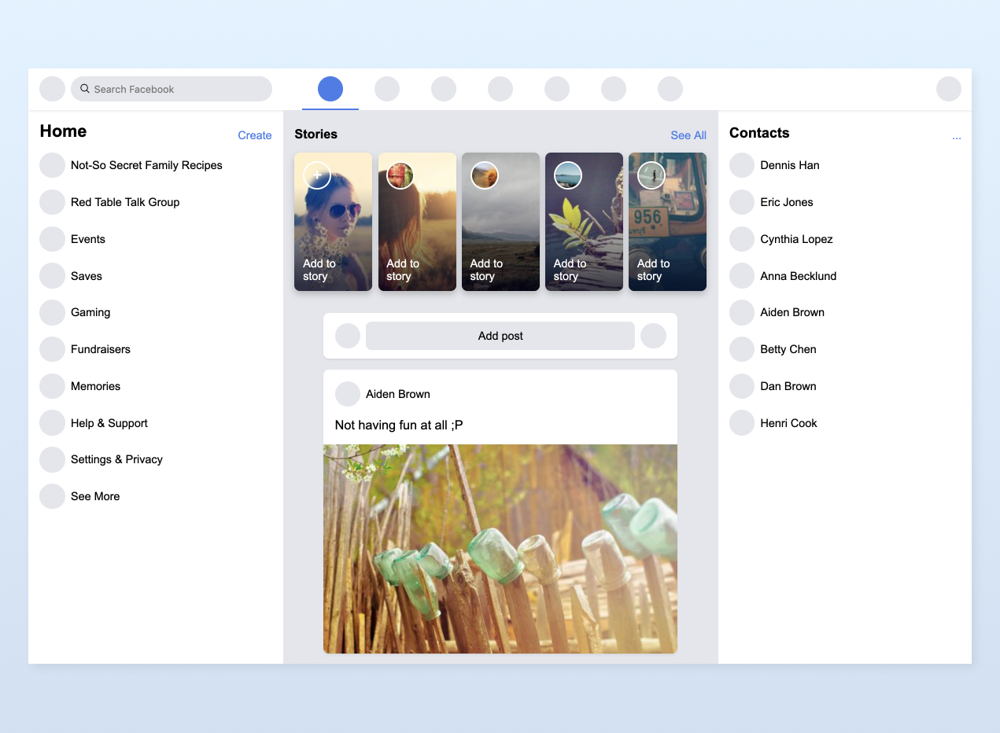

# Facebook clone

We build the layout of a new facebook home.

# Install

We are using Ruby with [Cuba](https://github.com/soveran/cuba), a microframework for web development. To up the project following this steps:

Install framework cuba

```bash
$ gem install cuba
```

Now, up the server

```bash
$ rackup
```

## Result


